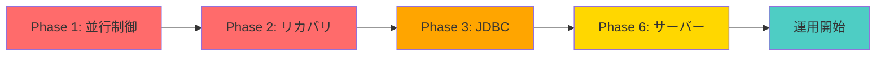
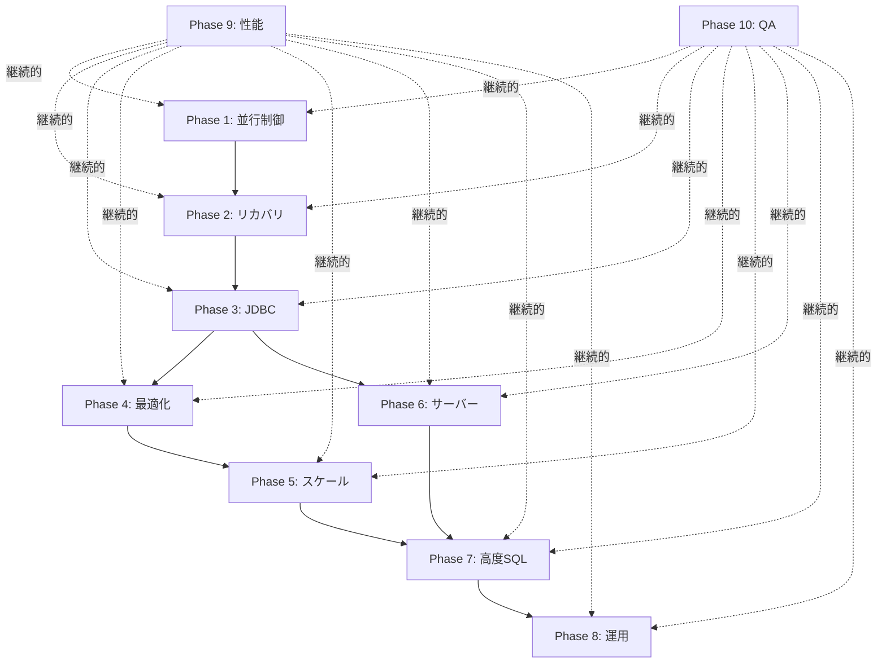

# MiniDB 実装プラン

## Database Design and Implementation (Second Edition) 完全実装ロードマップ

---

## 📚 教科書の章構成と実装状況

### ✅ 完了済み（Phase 0）

#### Part 1: 基礎レイヤー

- **Chapter 1-2: Introduction & JDBC Overview**
  - ✅ 基本設計完了
  - ❌ JDBC実装は未完了（Phase 3で実装予定）

- **Chapter 3: Disk and File Management**
  - ✅ `FileMgr`: 固定長ブロックの読み書き
  - ✅ `Page`: バイト配列の抽象化
  - ✅ `BlockId`: ブロック識別子
  - ✅ ファイル操作（append, delete, length）

- **Chapter 4: Memory Management**
  - ✅ `BufferMgr`: バッファプール管理
  - ✅ `Buffer`: ページキャッシュ、ピン/アンピン
  - ✅ `LogManager`: Write-Ahead Logging
  - ⚠️ バッファ置換アルゴリズム（現在はNaive、LRU/Clock要改善）

- **Chapter 5: Transaction Management**
  - ✅ `Tx`: トランザクション基本実装
  - ✅ WAL (Write-Ahead Logging)
  - ✅ Commit/Rollback 基本機能
  - ❌ 並行制御（ロック）未実装 → **Phase 1で実装**
  - ❌ Recovery Manager未実装 → **Phase 2で実装**

#### Part 2: レコード管理

- **Chapter 6: Record Management**
  - ✅ `Schema`: テーブルスキーマ定義
  - ✅ `Layout`: レコードレイアウト計算
  - ✅ `RecordPage`: スロット管理
  - ✅ `TableFile`: テーブルファイル抽象化
  - ✅ `TableScan`: レコードスキャン

- **Chapter 7: Metadata Management**
  - ✅ `MetadataManager`: カタログ管理
  - ✅ システムカタログ（tblcat, fldcat, idxcat）
  - ✅ テーブル定義の保存・復元
  - ✅ インデックスメタデータ

#### Part 3: クエリ処理

- **Chapter 8: Query Processing**
  - ✅ `Scan` インターフェース
  - ✅ `TableScan`: テーブル全件スキャン
  - ✅ `SelectScan`: WHERE条件フィルタ
  - ✅ `ProjectScan`: 列射影
  - ✅ `ProductScan`: 直積（JOIN基本）
  - ❌ Merge Join未実装 → **Phase 4で実装**
  - ❌ Hash Join未実装 → **Phase 4で実装**

- **Chapter 9: Parsing**
  - ✅ `Lexer`: 字句解析
  - ✅ `Parser`: 構文解析
  - ✅ `Ast`: 抽象構文木
  - ✅ DDL/DML/DQL 構文対応

- **Chapter 10: Planning**
  - ✅ `Planner`: クエリプランナー基本実装
  - ✅ Index Scan 最適化
  - ✅ Index Join 最適化
  - ⚠️ コストベース最適化未実装 → **Phase 4で実装**
  - ❌ 統計情報未実装 → **Phase 4で実装**

#### Part 4: 高度な機能

- **Chapter 11: JDBC Interfaces**
  - ❌ **未実装** → **Phase 3で実装予定**

- **Chapter 12: Indexing**
  - ✅ B+木インデックス基本実装
  - ✅ 等値検索、範囲検索
  - ✅ インデックス自動メンテナンス
  - ❌ ハッシュインデックス（現在の実装は使用されていない）
  - ⚠️ 複合インデックス未対応 → **Phase 5で実装**

- **Chapter 13-15: Materialization & Sorting**
  - ✅ `OrderByScan`: メモリ内ソート
  - ✅ `GroupByScan`: 集約
  - ✅ `DistinctScan`: 重複排除
  - ❌ 外部ソート未実装 → **Phase 5で実装**
  - ❌ 外部集約未実装 → **Phase 5で実装**

---

## 🎯 実装プラン詳細

### **Phase 1: 並行制御の完全実装** 🔒

**目標**: マルチスレッド環境でのデータ整合性確保  
**期間**: 2-3週間  
**状態**: 🟢 **Week 1完了** (2025-11-16)  
**ブランチ**: `feature/phase1-locking`

#### 1.1 ロック管理 (`app.tx.lock`) ✅ **完了**

```java
// 作成済みファイル
✅ LockType.java          // SHARED / EXCLUSIVE enum
✅ Lock.java              // 単一ブロックのロック管理
✅ LockAbortException.java // タイムアウト例外
✅ LockTable.java         // グローバルロックテーブル
✅ LockManager.java       // トランザクション毎のロック追跡
⏳ DeadlockDetector.java  // デッドロック検出（Week 2予定）
```

**実装完了項目**:

- [x] **Strict Two-Phase Locking (2PL)** プロトコル
- [x] **Shared Lock / Exclusive Lock**
- [x] **ロック取得・解放API** (`sLock/xLock/unlock`)
- [x] **ロックアップグレード** (S→X)
- [x] **タイムアウト機構** (デフォルト10秒)
- [x] **FIFO待機キュー** (公平性保証)
- [ ] デッドロック検出（Wait-For Graph）← **Week 2で実装予定**

**変更済みファイル**:

- ✅ `Tx.java`: getInt/getString→sLock, setInt/setString→xLock, commit/rollback→release
- ⏳ `TableScan.java`: レコードロック統合（Week 3予定）

**テスト状況**:

- [x] **単体テスト**: 30テスト全て成功 ✅
  - `LockTest.java` (10テスト)
  - `LockTableTest.java` (6テスト)
  - `LockManagerTest.java` (9テスト)
  - `ConcurrencyTest.java` (5テスト)
- [x] **デモプログラム**: `LockingDemo.java` 実行成功
  - Lost Update 防止 ✅
  - Dirty Read 防止 ✅
  - 共有ロック（複数読み取り）✅

**ドキュメント**:

- [x] `docs/LOCKING_LOGIC_DIAGRAMS.md` 完成
  - アーキテクチャ図
  - シーケンス図
  - 状態遷移図
  - Strict 2PL プロトコル説明

#### 1.2 分離レベル (`app.tx.isolation`) ⏳ **Week 2予定**

```java
// Week 2で作成予定
- IsolationLevel.java    // READ_UNCOMMITTED, READ_COMMITTED, etc.
- DeadlockDetector.java  // Wait-For Graph実装
```

**実装予定項目**:

- [ ] READ UNCOMMITTED
- [ ] READ COMMITTED
- [ ] REPEATABLE READ
- [ ] SERIALIZABLE
- [ ] Wait-For Graph によるデッドロック検出
- [ ] Victim 選択と自動ロールバック

**追加テスト計画**:

- [ ] Non-repeatable Read防止テスト
- [ ] Phantom Read防止テスト
- [ ] デッドロック検出テスト

---

### **Phase 2: リカバリ機能の完全実装** 🔄

**目標**: クラッシュからの自動復旧  
**期間**: 2-3週間

#### 2.1 Recovery Manager (`app.tx.recovery`)

```java
// 新規作成ファイル
- RecoveryManager.java   // UNDO/REDO ログ管理
- CheckpointManager.java // チェックポイント
- LogRecord.java         // ログレコード型拡張
```

**実装項目**:

- [ ] UNDO ログ（現在部分実装済み）
- [ ] REDO ログ
- [ ] UNDO/REDO ログ（両方）
- [ ] チェックポイント機能
- [ ] クラッシュリカバリ（システム起動時）
- [ ] フォワードリカバリ

**ログレコード拡張**:

```java
// 現在: START, COMMIT, ROLLBACK, SET_INT
// 追加: SET_STRING, UPDATE, DELETE, CHECKPOINT, END
```

**変更ファイル**:

- `Tx.java`: REDO情報記録
- `FileMgr.java`: システム起動時リカバリ呼び出し
- `LogCodec.java`: 新ログタイプ追加

**テスト**:

- [ ] トランザクション途中でクラッシュシミュレーション
- [ ] Undo-only リカバリテスト
- [ ] Redo-only リカバリテスト
- [ ] チェックポイントからのリカバリテスト

---

### **Phase 3: JDBC ドライバー実装** 🔌

**目標**: 標準JDBC経由でのアクセス  
**期間**: 3-4週間

#### 3.1 基本インターフェース (`app.jdbc`)

```java
// 新規作成ファイル
- MiniDBDriver.java           // java.sql.Driver実装
- MiniDBConnection.java       // java.sql.Connection実装
- MiniDBStatement.java        // java.sql.Statement実装
- MiniDBPreparedStatement.java// java.sql.PreparedStatement実装
- MiniDBResultSet.java        // java.sql.ResultSet実装
- MiniDBResultSetMetaData.java// java.sql.ResultSetMetaData実装
- MiniDBDatabaseMetaData.java // java.sql.DatabaseMetaData実装
```

**実装項目**:

**3.1.1 Driver**

- [ ] `connect(String url, Properties info)`
- [ ] URL解析: `jdbc:minidb:<path>` or `jdbc:minidb://<host>:<port>/<db>`
- [ ] DriverManager登録

**3.1.2 Connection**

- [ ] `createStatement()`
- [ ] `prepareStatement(String sql)`
- [ ] `commit()` / `rollback()`
- [ ] `setAutoCommit(boolean)`
- [ ] `setTransactionIsolation(int level)`
- [ ] `getMetaData()`

**3.1.3 Statement**

- [ ] `executeQuery(String sql)` → ResultSet
- [ ] `executeUpdate(String sql)` → int
- [ ] `execute(String sql)` → boolean
- [ ] バッチ実行対応

**3.1.4 PreparedStatement**

- [ ] `setInt(int, int)` / `setString(int, String)`
- [ ] `executeQuery()` / `executeUpdate()`
- [ ] パラメータバインディング

**3.1.5 ResultSet**

- [ ] `next()` / `previous()` / `first()` / `last()`
- [ ] `getInt(String)` / `getString(String)`
- [ ] `getInt(int)` / `getString(int)`
- [ ] `getMetaData()`
- [ ] カーソル位置管理

**3.1.6 DatabaseMetaData**

- [ ] `getTables()`
- [ ] `getColumns()`
- [ ] `getIndexInfo()`
- [ ] `getPrimaryKeys()`
- [ ] `getForeignKeys()`

**統合**:

- `Planner`と`Tx`を内部で使用
- コネクション毎に独立したトランザクション

**テスト**:

- [ ] JDBC経由でのCRUD操作
- [ ] PreparedStatement動作確認
- [ ] トランザクション境界テスト
- [ ] メタデータ取得テスト

**使用例**:

```java
// アプリケーションから使用
Class.forName("app.jdbc.MiniDBDriver");
Connection conn = DriverManager.getConnection("jdbc:minidb:./data");

PreparedStatement ps = conn.prepareStatement(
    "SELECT * FROM users WHERE age > ?"
);
ps.setInt(1, 25);
ResultSet rs = ps.executeQuery();

while (rs.next()) {
    System.out.println(rs.getString("name"));
}

rs.close();
ps.close();
conn.close();
```

---

### **Phase 4: クエリ最適化の高度化** 🚀

**目標**: コストベース最適化、統計情報活用  
**期間**: 3-4週間

#### 4.1 統計情報 (`app.metadata.stats`)

```java
// 新規作成ファイル
- TableStats.java        // テーブル統計
- IndexStats.java        // インデックス統計
- Histogram.java         // ヒストグラム
- StatisticsManager.java // 統計情報管理
```

**収集する統計**:

- [ ] テーブル行数
- [ ] カラム別カーディナリティ（ユニーク値数）
- [ ] NULL値の割合
- [ ] データ分布（ヒストグラム）
- [ ] インデックス高さ・ページ数

**実装項目**:

- [ ] ANALYZE コマンド実装
- [ ] 統計情報の永続化（syscat拡張）
- [ ] 統計情報の自動更新（閾値ベース）

#### 4.2 コストモデル (`app.sql.optimizer`)

```java
// 新規作成ファイル
- CostEstimator.java     // コスト見積もり
- JoinOrderOptimizer.java// 結合順序最適化
- IndexSelector.java     // インデックス選択
```

**実装項目**:

- [ ] Scan コスト計算（SeqScan, IndexScan）
- [ ] Join コスト計算（NestedLoop, MergeJoin, HashJoin）
- [ ] Selectivity 推定
- [ ] 動的計画法による結合順序最適化

#### 4.3 物理演算子拡張 (`app.query`)

```java
// 新規作成ファイル
- MergeJoinScan.java     // ソート済み結合
- HashJoinScan.java      // ハッシュ結合
- SortMergeScan.java     // 外部ソートマージ
```

**実装項目**:

- [ ] Merge Join（ソート前提）
- [ ] Hash Join（ハッシュテーブル構築）
- [ ] Semi Join / Anti Join
- [ ] 結合アルゴリズム選択ロジック

**変更ファイル**:

- `Planner.java`: コストベース選択追加

**テスト**:

- [ ] 大規模データでのパフォーマンステスト
- [ ] 結合順序による性能比較
- [ ] 統計情報精度検証

---

### **Phase 5: スケーラビリティ向上** 📈

**目標**: 大規模データ処理対応  
**期間**: 4-5週間

#### 5.1 外部ソート (`app.query.sort`)

```java
// 新規作成ファイル
- ExternalSortScan.java  // 外部ソート
- SortedRun.java         // ソート済みラン
- MergePhase.java        // マージフェーズ
```

**実装項目**:

- [ ] 多段階マージソート
- [ ] ディスクベース一時ファイル
- [ ] バッファ効率的利用
- [ ] ORDER BY での自動使用

#### 5.2 外部集約 (`app.query.aggregate`)

```java
// 新規作成ファイル
- ExternalGroupByScan.java  // 外部GROUP BY
- HashAggregation.java      // ハッシュ集約
```

**実装項目**:

- [ ] ソートベース集約
- [ ] ハッシュベース集約
- [ ] メモリ溢れ時の処理

#### 5.3 複合インデックス (`app.index`)

```java
// 変更ファイル
- BTreeIndex.java        // 複合キー対応
- SearchKey.java         // 複合キー拡張
```

**実装項目**:

- [ ] 複数カラムのインデックス
- [ ] 部分一致検索
- [ ] カバリングインデックス

#### 5.4 文字列インデックス

**実装項目**:

- [ ] STRING型のB+木キー対応
- [ ] 前方一致検索（LIKE 'prefix%'）

**テスト**:

- [ ] 100万行以上のデータでのソートテスト
- [ ] メモリ制約下での集約テスト
- [ ] 複合インデックスの選択性テスト

---

### **Phase 6: ネットワークサーバー** 🌐

**目標**: クライアント・サーバー型アーキテクチャ  
**期間**: 4-5週間

#### 6.1 サーバー実装 (`app.server`)

```java
// 新規作成ファイル
- MiniDBServer.java      // メインサーバー
- ClientHandler.java     // クライアント接続処理
- Protocol.java          // 通信プロトコル
- SessionManager.java    // セッション管理
```

**実装項目**:

- [ ] TCP/IPサーバーソケット
- [ ] マルチスレッド接続処理
- [ ] コネクションプーリング
- [ ] セッション管理（認証情報、トランザクション状態）

#### 6.2 プロトコル定義

```java
// シンプルなテキストプロトコル
CONNECT <user> <password>
QUERY <sql>
EXEC <sql>
PREPARE <stmt_id> <sql>
EXEC_PREPARED <stmt_id> <params>
COMMIT
ROLLBACK
CLOSE <stmt_id>
DISCONNECT
```

**実装項目**:

- [ ] リクエスト/レスポンスフォーマット定義
- [ ] エラーハンドリング
- [ ] 結果セットストリーミング

#### 6.3 クライアント実装 (`app.client`)

```java
// 新規作成ファイル
- MiniDBClient.java      // CLIクライアント
- RemoteConnection.java  // リモート接続
```

#### 6.4 JDBC統合

- [ ] JDBCドライバーのリモート接続対応
- [ ] `jdbc:minidb://host:port/database` URL対応

**セキュリティ**:

- [ ] ユーザー認証
- [ ] パスワードハッシュ化
- [ ] SSL/TLS対応（オプション）

**テスト**:

- [ ] 複数クライアント同時接続
- [ ] トランザクション分離テスト
- [ ] 高負荷テスト

---

### **Phase 7: 高度な SQL 機能** 📊

**目標**: SQL標準準拠度向上  
**期間**: 3-4週間

#### 7.1 追加DML

**実装項目**:

- [ ] `UPDATE ... WHERE` 複数カラム対応（完了済み）
- [ ] `DELETE ... WHERE` 複雑な条件対応
- [ ] `TRUNCATE TABLE`
- [ ] `REPLACE INTO` / `INSERT OR REPLACE`

#### 7.2 追加DDL

```sql
- ALTER TABLE ADD COLUMN
- ALTER TABLE DROP COLUMN
- ALTER TABLE RENAME COLUMN
- CREATE VIEW
- DROP VIEW
- CREATE UNIQUE INDEX
- PRIMARY KEY / FOREIGN KEY 制約
```

#### 7.3 サブクエリ

```sql
- SELECT * FROM (SELECT ...) AS subquery
- WHERE col IN (SELECT ...)
- WHERE EXISTS (SELECT ...)
- スカラーサブクエリ
```

**実装**:

- `Parser.java`: サブクエリ構文追加
- `Ast.java`: SubqueryExpr追加
- `Planner.java`: サブクエリマテリアライゼーション

#### 7.4 高度な述語

```sql
- OR / AND / NOT の任意ネスト
- LIKE 'pattern%'
- IN (value1, value2, ...)
- CASE WHEN ... END
```

#### 7.5 集約関数拡張

```sql
- DISTINCT 集約: COUNT(DISTINCT col)
- STDDEV, VARIANCE
- MEDIAN, PERCENTILE
```

#### 7.6 ウィンドウ関数

```sql
- ROW_NUMBER() OVER (ORDER BY ...)
- RANK() OVER (PARTITION BY ... ORDER BY ...)
- LAG/LEAD
```

**テスト**:

- [ ] SQL標準適合性テストスイート
- [ ] TPC-Hクエリ互換テスト

---

### **Phase 8: 運用機能** 🛠️

**目標**: プロダクション運用対応  
**期間**: 2-3週間

#### 8.1 バックアップ・リストア

```java
// 新規作成
- BackupManager.java     // オンラインバックアップ
- RestoreManager.java    // リストア処理
```

**実装項目**:

- [ ] ホットバックアップ（オンライン）
- [ ] コールドバックアップ（オフライン）
- [ ] 増分バックアップ
- [ ] Point-in-Time Recovery

#### 8.2 監視・診断

```java
- PerformanceMonitor.java // パフォーマンス監視
- QueryProfiler.java      // クエリプロファイラ
- SystemCatalog.java      // システムビュー拡張
```

**システムビュー**:

```sql
- sys.tables              -- テーブル一覧
- sys.indexes             -- インデックス一覧
- sys.statistics          -- 統計情報
- sys.sessions            -- アクティブセッション
- sys.locks               -- ロック状況
- sys.transactions        -- トランザクション状況
- sys.query_log           -- クエリログ
```

#### 8.3 管理コマンド

```sql
- ANALYZE TABLE <table>   -- 統計情報更新
- VACUUM                  -- 領域回収
- REINDEX <index>         -- インデックス再構築
- EXPLAIN ANALYZE         -- 実行計画+実測
```

#### 8.4 設定管理

```java
- ConfigManager.java      // 設定管理
```

**設定項目**:

```properties
buffer_pool_size=1000
max_connections=100
log_level=INFO
checkpoint_interval=300000
transaction_timeout=30000
```

---

### **Phase 9: パフォーマンスチューニング** ⚡

**目標**: 高速化とボトルネック解消  
**期間**: 継続的

#### 9.1 バッファ管理改善

- [ ] LRU置換アルゴリズム実装
- [ ] Clock置換アルゴリズム実装
- [ ] Adaptive Replacement Cache (ARC)
- [ ] バッファプールの動的サイズ調整

#### 9.2 インデックス最適化

- [ ] B+木のファンアウト最適化
- [ ] Bulk Loading最適化
- [ ] インデックス圧縮

#### 9.3 並列処理

```java
- ParallelScanExecutor.java  // 並列スキャン
- ParallelJoinExecutor.java  // 並列結合
```

**実装項目**:

- [ ] テーブルスキャンの並列化
- [ ] パーティション並列
- [ ] Intra-query parallelism

#### 9.4 キャッシュ戦略

- [ ] クエリ結果キャッシュ
- [ ] 実行プランキャッシュ
- [ ] メタデータキャッシュ

---

### **Phase 10: テストとドキュメント** 📚

**目標**: 品質保証と使いやすさ向上  
**期間**: 継続的

#### 10.1 テストカバレッジ

- [ ] 単体テスト: 90%以上カバレッジ
- [ ] 統合テスト: 全主要機能
- [ ] パフォーマンステスト: ベンチマーク
- [ ] ストレステスト: 限界値確認

#### 10.2 ベンチマーク

```java
// 新規作成
- TpcBenchmark.java      // TPC-H/TPC-C互換
- CustomBenchmark.java   // カスタムベンチマーク
```

#### 10.3 ドキュメント

- [ ] API Javadoc完備
- [ ] アーキテクチャドキュメント
- [ ] ユーザーマニュアル
- [ ] 開発者ガイド
- [ ] パフォーマンスチューニングガイド

---

## 📊 優先順位マトリクス

| Phase | 優先度 | 難易度 | 期間 | 依存関係 |
|-------|--------|--------|------|---------|
| Phase 1: 並行制御 | 🔴 最高 | ⭐⭐⭐ | 2-3週 | なし |
| Phase 2: リカバリ | 🔴 最高 | ⭐⭐⭐⭐ | 2-3週 | Phase 1 |
| Phase 3: JDBC | 🟠 高 | ⭐⭐⭐⭐ | 3-4週 | Phase 1, 2 |
| Phase 4: 最適化 | 🟠 高 | ⭐⭐⭐⭐⭐ | 3-4週 | Phase 1-3 |
| Phase 5: スケール | 🟡 中 | ⭐⭐⭐⭐ | 4-5週 | Phase 4 |
| Phase 6: サーバー | 🟡 中 | ⭐⭐⭐⭐ | 4-5週 | Phase 3 |
| Phase 7: 高度SQL | 🟢 低 | ⭐⭐⭐ | 3-4週 | Phase 4 |
| Phase 8: 運用 | 🟢 低 | ⭐⭐ | 2-3週 | Phase 1-6 |
| Phase 9: 性能 | 🔵 継続 | ⭐⭐⭐⭐⭐ | 継続 | 全Phase |
| Phase 10: QA | 🔵 継続 | ⭐⭐ | 継続 | 全Phase |

---

## 🎯 推奨実装順序

### 最短で動作するJDBCサーバーを目指す場合



### 教科書完全準拠を目指す場合



---

## 📈 現在の完成度

```
教科書全体の実装進捗: 約 45%

Part 1 (基礎): ████████░░ 80%
Part 2 (レコード): ██████████ 100%
Part 3 (クエリ): ███████░░░ 70%
Part 4 (高度): ████░░░░░░ 40%
Part 5 (最適化): ██░░░░░░░░ 20%
Part 6 (運用): ░░░░░░░░░░ 0%
```

---

## 🚀 次のアクション

### 即座に開始すべき（Phase 1）

1. **ロック管理の実装**

   ```bash
   mkdir -p src/main/java/app/tx/lock
   touch src/main/java/app/tx/lock/LockTable.java
   touch src/main/java/app/tx/lock/LockManager.java
   ```

2. **テストケース作成**

   ```bash
   mkdir -p src/test/java/app/tx/lock
   touch src/test/java/app/tx/lock/ConcurrencyTest.java
   ```

3. **設計ドキュメント作成**

   ```bash
   touch docs/LOCKING_STRATEGY.md
   touch docs/ISOLATION_LEVELS.md
   ```

### Phase 1 完了後（Phase 2-3）

1. Recovery Manager実装
2. JDBC Driver実装
3. 統合テスト

---

## 📝 進捗管理

進捗は以下で追跡します：

1. **GitHub Issues**: 各Phase毎にIssue作成
2. **GitHub Projects**: Kanban ボードで管理
3. **Milestones**: Phase毎にマイルストーン設定
4. **Pull Requests**: 機能単位でPR作成

**ブランチ戦略**:

```
main
├── feature/phase1-locking
├── feature/phase2-recovery
├── feature/phase3-jdbc
└── ...
```

---

## 🎓 学習リソース

各Phaseの実装に役立つ参考資料：

### 並行制御・トランザクション

- "Transaction Processing" by Jim Gray
- "Concurrency Control and Recovery in Database Systems" by Bernstein et al.
- PostgreSQL internals documentation

### クエリ最適化

- "Database System Concepts" by Silberschatz et al.
- "Database Management Systems" by Ramakrishnan & Gehrke
- SQLite query planner documentation

### JDBC

- Oracle JDBC Specification
- Apache Derby JDBC implementation
- H2 Database JDBC implementation

---

## 📧 質問・議論

実装中の質問や設計議論は以下で行います：

- GitHub Discussions
- Issue コメント
- Pull Request レビュー

---

**最終更新**: 2025-11-16  
**バージョン**: 0.16.0  
**次期目標**: Phase 1 並行制御の完全実装
